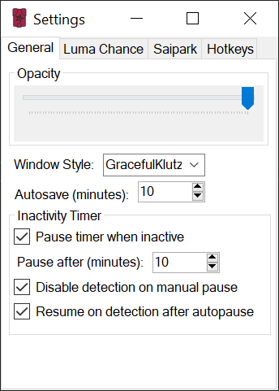
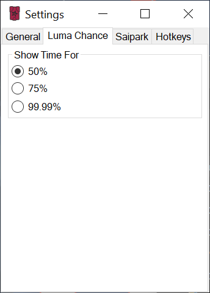

# TemtemTracker Settings

There are multiple settings available to tailor your TemtemTracker experience to your needs and wants. The tracker settings are divided into four groups described in detail in the text below.

## Table of Contents

[Other Documents of Interest](#Other-Documents-of-Interest)\
[General](#General)\
[Luma Chance](#Luma-Chance)\
[Saipark](#Saipark)\
[Hotkeys](#Hotkeys)

## Other Documents of Interest

[Index](Readme.md)\
[TemtemTracker features](TemtemTrackerFeatures.md)\
[How to: Styles](HowToStyles.md)

## General 

The general settings tab, visible in the image below, features settings that customize the general appearance and behavior of the tracker.

The Opacity slider can be moved left or right to make the main tracker window and individual tracking windows more or less transparent. 

The Window Style drop down menu can be used to select the style or theme that the tracker will use.

The Autosave setting allows you to select the interval at which the tracker will automatically save your encounters, reducing data loss in an event of a crash.

The Inactivity Timer settings revolve around the automatic pausing of the tracker when you are inactive. Inactivity is time spent not interacting with the tracker table (deleting rows, refreshing the table) or encountering Temtem. When the *Pause timer when inactive* checkbox is selected, the timer will automatically be paused when you're inactive for a period of time determined by the Pause after setting.

The *Disable detection on manual pause* checkbox disables the detection of Temtem when the timer has been manually paused (using the shortcut configured in the hotkeys tab or the option in the file dropdown menu)

The *Resume on detection after autopause* checkbox enables automatically resuming a timer that has been automatically paused due to inactivity when a Temtem is encountered. 

## Luma Chance 

The Luma Chance tab, visible in the image below, allows you to select the probability of having encountered a luma to calculate the *Time to Luma* value in the tracker's table for.

**IMPORTANT NOTE:** The probability of having already encountered one or more lumas is based on the geometric distribution. Each individual encounter is always an individual roll at the odds for that individual Temtem and does not add up to an increased chance on the next encounter. Instead think of this as your overall chance of having encountered a luma within that number of encounters or the percentage of players that would have already encountered a luma within that amount of encounters. **YOU ARE NEVER GUARANTEED A LUMA**

## Saipark 

The Saipark settings tab, visible in the image below, allows you to enable calculating luma odds using multipliers for individual Temtem, so that your odds of having encountered a luma align with the luma chance as it is in Saipark. These settings are globally applied to all Temtem of the selected species as TemtemTracker has no way of knowing if you are in Saipark.

The *Enable Saipark Mode* checkbox enables or disables calculating odds and times using the Saipark multipliers selected below. The values in the table will be recalculated on your next encounter.

The *Temtem 1* and *Temtem 2* settings allow you to select a Temtem species and a luma chance multiplier that will be applied to the luma chance for that particular species.

## Hotkeys

The Hotkeys tab, visible below, allows you to remap the table reset and timer pause actions to keys of your choosing. These can be combinations of CTRL, ALT, SHIFT and keyboard keys. 

