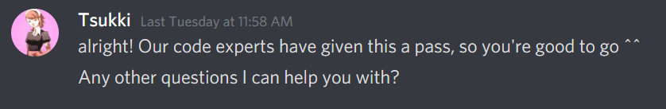

### Scroll to Releases below for download

# TemtemTracker
Temtem Tracker is a tracker for encountered Temtem based on Optical Character Recognition. 

The tracker:  
**DOES NOT** read Temtem memory  
**DOES NOT** intercept any Client-Server communication  
**DOES NOT** send any requests of its own to any server  
**DOES NOT** automate any part of gameplay  
**DOES NOT** do anything a player couldn't do themselves using pen and paper  
**WILL NOT** get you banned

## Table of contents

[Requirements](#requirements)  
[Releases](#releases)  
[Update Notes](#update-notes)  
[Help](#help)

## Requirements

#### Window visibility

For the application to work you must not obstruct any of the interface elements used for detection. These are the Temtem names, minimap and buttons in the bottom row of the game interface that appears during battles.

#### Supported aspect ratios:

- 16:9
- 16:10
- 4:3
- 43:18 (One of 3 aspect ratios marketed as 21:9)
- 16:3 (still vulnerable to a detection error in omninesia)

#### Minimum supported resolution:

The tracker requires a minimum resolution of 720p or equivalent level of detail at your aspect ratio of choice to be able to detect Temtem reliably.

#### Required software packages:
TemtemTracker V3 requires .NET 4.5.2  and Visual C++ Redistributable 2017 in order to work. 

Windows 10 users most likely already have .NET, as it is part of the Windows 10 Creators Update.

.NET 4.5.2 For Win 8.1 and lower can be found here: [.NET 4.5.2](https://www.microsoft.com/en-us/download/details.aspx?id=42642);

Visual C++ Redistributable 2017 can be downloaded here: 

- [vc_redist.x86.exe (32-bit)](https://aka.ms/vs/16/release/vc_redist.x86.exe)
- [vc_redist.x64.exe (64-bit)](https://aka.ms/vs/16/release/vc_redist.x64.exe) 

OR found here: [Latest supported Visual C++ Downloads](https://support.microsoft.com/en-us/help/2977003/the-latest-supported-visual-c-downloads)

## Releases

#### Current release:

- [TemtemTracker V4.0](https://github.com/mculig/TemtemTracker/releases/download/V4.0/TemtemTracker_v4.0_x64.zip)
- [TemtemTracker V4.0 (32-bit)](https://github.com/mculig/TemtemTracker/releases/download/V4.0/TemtemTracker_v4.0_x86.zip)

#### Old releases:

[Releases](https://github.com/mculig/TemtemTracker/releases)

## Update notes

### V4.0

#### New features

- Support for Temtem windows in Sandboxie (only default window names with [#] appended and prepended, no sandbox names)
- Statistics Window
- Added Yami (made by Yami) and GracefulKlutz styles

#### Bugfixes/optimization

- Improved error logging level of detail. Now your logs will make it easier for me to help you get the tracker running
- Decreased number of pixels necessary for objects to no longer be recognized as letters, speeding up detection
- Added additional checks to post-OCR, eliminating some sources of false and missed detections
- Fixed coding error that would make Myx undetectable due to the name being too short
- Added shutdown prevention to prevent table.json file corruption due to shutdown happening before the table can be written
- Fixed menu Unpause button not starting Timer back up after autopause
- Fixed 4:3 Aspect Ratio detection spots being wrong
- Fixed detection issues on lake in Citerior Omninesia (still missing spots in 16:3 aspect ratio)
- Fixed Individual Window timer showing 00:00:00 if timer is paused right after tracker is started

#### Known issues

- Font size scaling from primary monitor causes font to be tiny on secondary monitor with higher resolution/different scaling. This is an issue with the underlying framework and can not yet be addressed at this time. 
- False detections/Missed detections are still possible on water encounters with clouds in the background

#### Update history

[UpdateHistory](UpdateHistory.md)

## Help

Details about the interface, settings and how to make your own styles can be found in the following documents:

[TemtemTracker features](TemtemTrackerFeatures.md)  
[How to: Settings](HowToSettings.md)  
[How to: Styles](HowToStyles.md)
