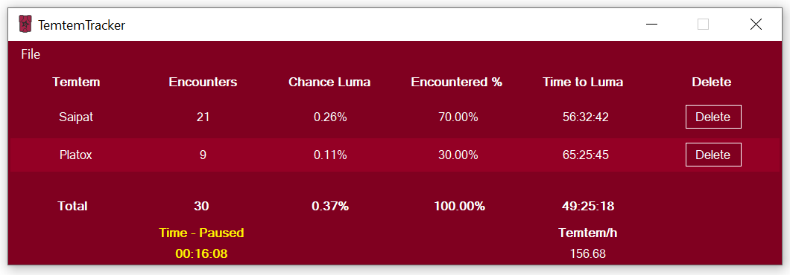

# Temtem Tracker

Temtem Tracker is a tracker for encountered Temtem based on Optical Character Recognition. 

The tracker: 
* **DOES NOT** read Temtem memory. 
* **DOES NOT** intercept any Client-Server communication. 
* **DOES NOT** send any requests of its own to any server.
* **DOES NOT** automate any part of gameplay
* **DOES NOT** do anything a player couldn't do themselves using pen and paper
* **WILL NOT** get you banned

## Requirements

If your tracker isn't working at all, it may be due to you lacking the required software packages.

TemtemTracker V2 requires **.NET 4.5.2**  and **Visual C++ Redistributable 2017** in order to work. 

Windows 10 users most likely already have .NET 4.7, as it is part of the Windows 10 Creators Update.

.NET 4.5.2 can be found here: [.NET 4.5.2](https://www.microsoft.com/en-us/download/details.aspx?id=42642);

Visual C++ Redistributable 2017 can be downloaded here: 

- [vc_redist.x86.exe (32-bit)](https://aka.ms/vs/16/release/vc_redist.x86.exe)
- [vc_redist.x64.exe (64-bit)](https://aka.ms/vs/16/release/vc_redist.x64.exe) 

OR found here: [Latest supported Visual C++ Downloads](https://support.microsoft.com/en-us/help/2977003/the-latest-supported-visual-c-downloads)

## Releases

#### Current release:

[TemtemTracker V3](https://github.com/mculig/TemtemTracker/releases/download/V3.0/TemtemTracker_v3.0.rar)

#### Old releases:

[Releases](https://github.com/mculig/TemtemTracker/releases)

## Important notes

For the application to work you **MUST NOT** obstruct any of the interface elements used for detection (Spots 1-6 in images below) OR OCR (Frames 1 and 2 in images below)

## Controls

Default:

* Reset table and timer: ALT+F5
* Pause/restart timer: ALT+F8

These can be remapped in the settings

## Update notes

### V3.0

Version 3 is a port to C# with optimizations, rewrites and cleanup

#### New features

- Opacity. Make the tracker transparent and get it out of your way.
- Window Styles. Chose the window design that you like best. Tsukki is my favourite :)
- Visual indication of paused time. See if your timer is paused.
- Hotkey remapping. No longer be at the mercy of my poor choice of hotkeys
- Autosave. PC crashed? No worries! Your tracking data is automatically saved now.
- Save/Load. Want to track multiple things? Save your current table and refresh the timer. Load it later and continue tracking!
- Don't want the tracker showing you caught a Temtem when it was paused? There's an option for that in the settings.
- Sexy icons by Alice (Parou) Peters [alicepeters.de](alicepeters.de) [parou.moe](parou.moe)
- Added about window with a little info
- Pause and Reset now also show up in menu with shortcuts shown, in case you forget.
- Added error messages for certain problems, you will hopefully never see these :)

#### Bugfixes/optimization

- Severely reduced memory and CPU impact by switching to C#
- Optimizations in detection loop to reduce CPU usage
- Fixed other windows sometimes tricking the tracker due to having Temtem in their names
- Improved detection algorithm now supports low resolutions (tested 720p)
- Better pre-OCR cleanup to minimize false detections

### Update history

[UpdateHistory](UpdateHistory.md)

## How it works

The application relies on several dots to identify in-combat and out-of-combat situations, and 2 Frames to identify Temtem names using OCR. These dots and frames can be seen on the following 2 images:

The dots are marked 1-6 and are positioned at a location on the screen determined by the values:

* spotXWidthPercentage
* spotXHeightPercentage

In TemtemTracker/config/config.json

The ARGB values the application tests for can also be found in the config file:

* spotXRGB

The application has been tested to work at 3840x2160, 1920x1080 and 1600x900 resolutions without the need to modify the spot locations in the config file.

The OCR Frames location and dimensions are determined by the values:

* frameXPercentageLeft
* frameXPercentageTop
* frameWidthPercentage
* frameHeightPercentage

The application interface can be seen on the following image: 

The application tracks Temtem encountered, the number of encounters, the chance of having encountered a Luma of that species and the % that species represents in the total number of Temtem encountered, as well as totals for these values.

The Luma chance is based on the lumaChance value in TemtemTracker/config/config.json

The Window dimensions are saved upon exiting the application and can be found in TemtemTracker/config/userSettings.json

Finally, in order to clean up any artifacts in the OCR output, a string comparison operation is executed using the Temtem names found in TemtemTracker/config/temtemSpecies.json. This will need to be updated with new species when their names are released in order to keep the application reliable.